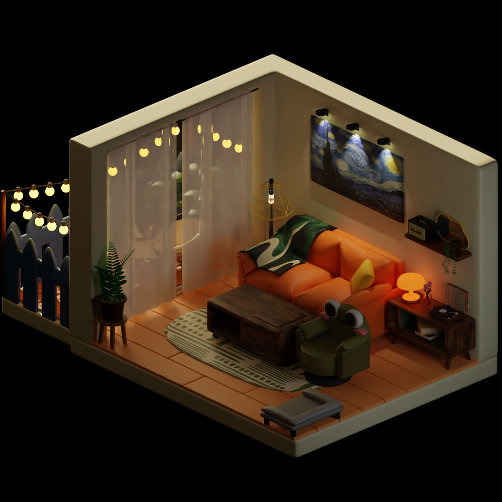
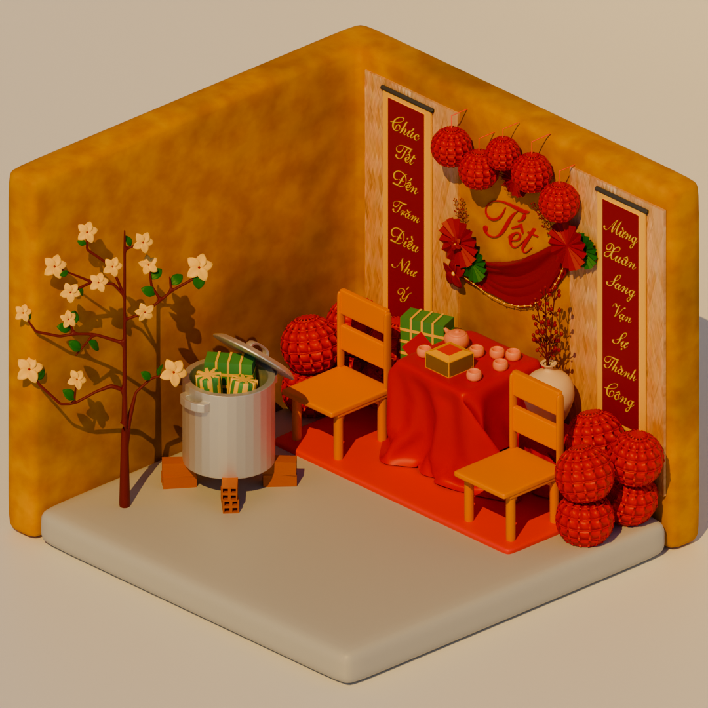
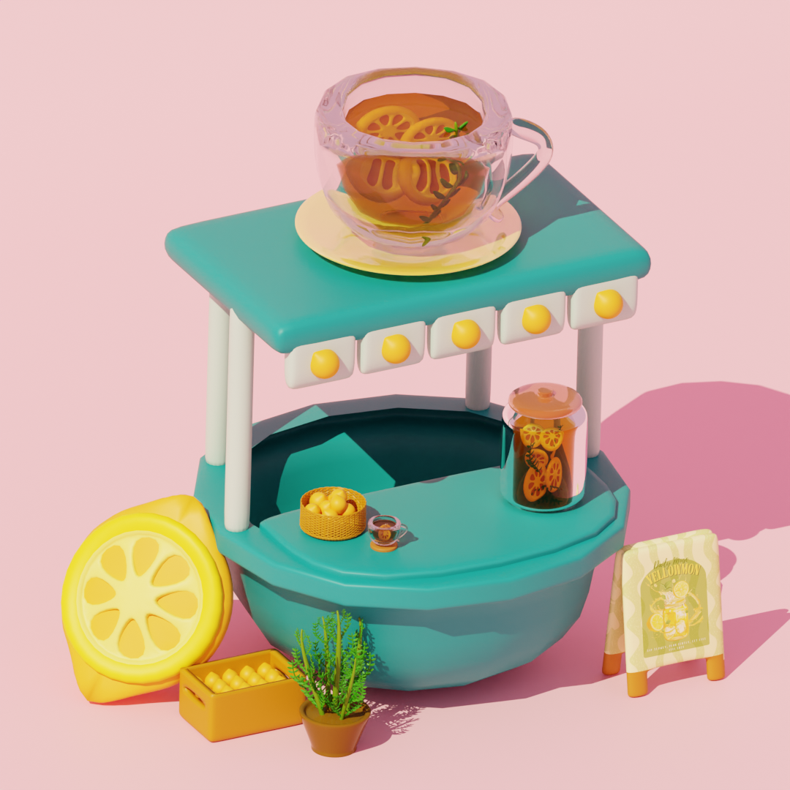
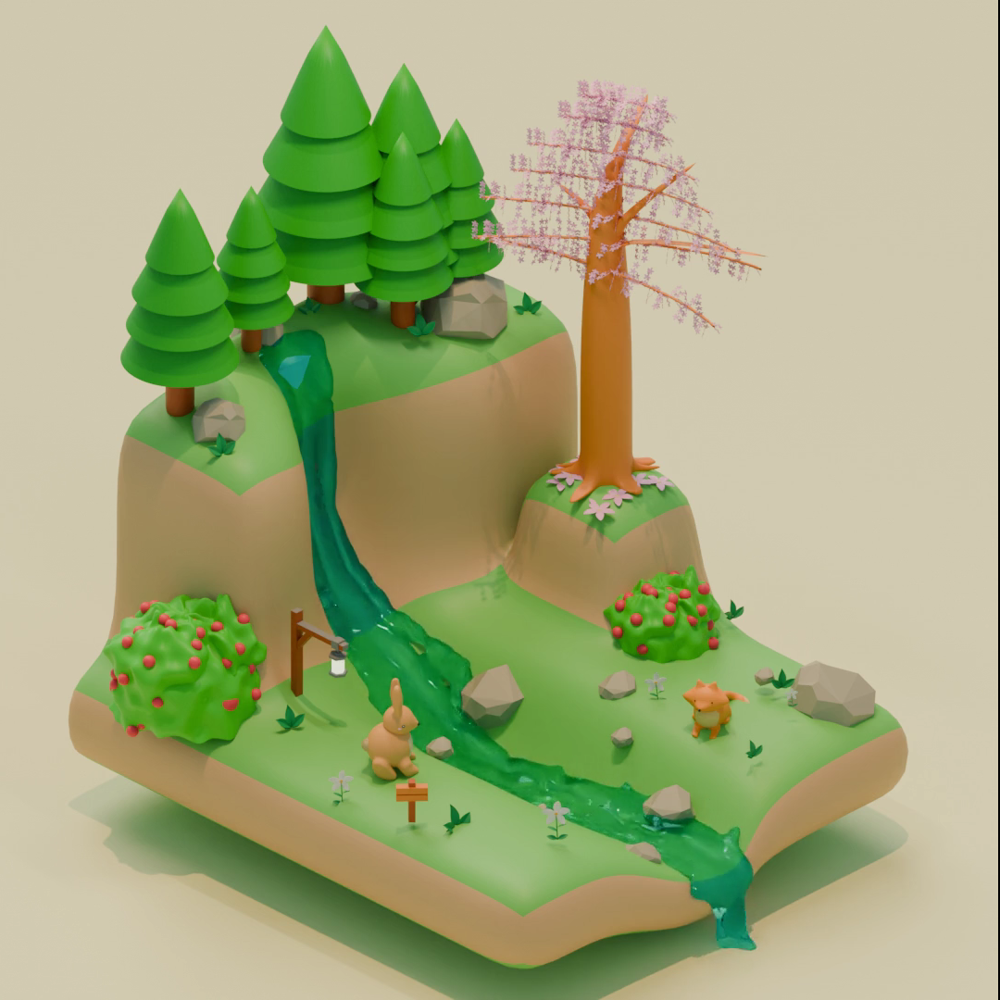
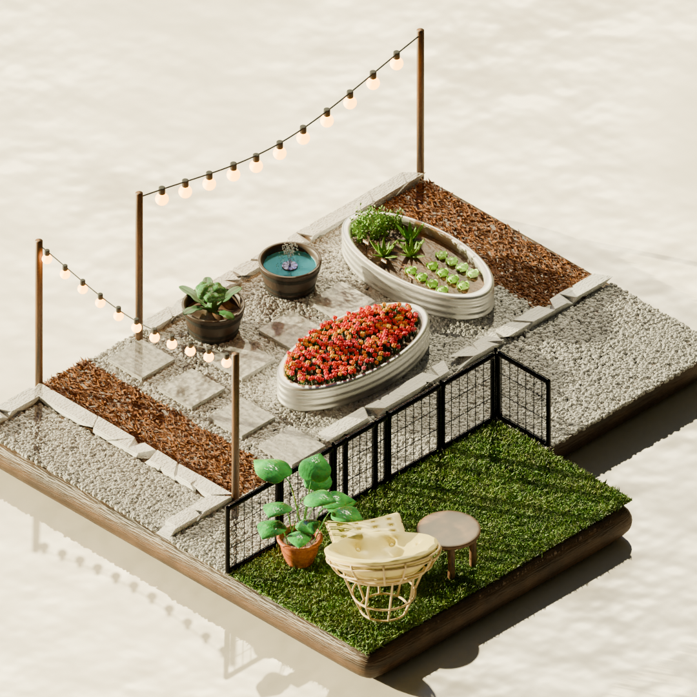

# Blender Portfolio

Welcome to my Blender Portfolio!

This repository showcases a collection of stylized 3D environments, props, and miniature scenes that I designed and created using Blender.

Each project focuses on improving different aspects of the 3D creation pipeline, including modeling, lighting, materials, composition, rendering, and storytelling.

---

# 🛠 Software

- Blender
- Cycles / Eevee

---

# 🎯 Skills Demonstrated

- 3D Modeling
- Environment Design
- Stylized Art
- Low Poly Modeling
- Hard Surface Modeling
- Interior Design
- Lighting
- Materials & Shading
- UV Mapping
- Composition
- Rendering
  
---

# Featured Projects

## 🏡 Cozy Living Room

A warm and modern stylized living room designed to create a relaxing atmosphere through lighting, furniture arrangement, and material design.

---

## 🧧 Vietnamese Tet 

A stylized Vietnamese New Year room celebrating Tet with traditional decorations, lanterns, lucky red colors, and festive atmosphere.

---

## 🍋 Lemonade Pop-Up

A colorful miniature lemonade stand created to practice stylized prop modeling, lighting, and product presentation.

---

## 🌲 Miniature Valley

A peaceful low-poly landscape featuring waterfalls, forests, rivers, and seasonal vegetation.

---

## 🥬 Lovely Garden

A miniature vegetable garden showcasing stylized plants, landscaping, and natural outdoor composition.

---

# 👨‍💻 About Me

I'm currently studying **Cybersecurity** while continuously improving my **3D Environment Art** skills using Blender.

I enjoy creating stylized miniature scenes that combine creativity, storytelling, and technical modeling techniques.

This portfolio reflects my passion for both technology and digital art.

---

## 📬 Contact

GitHub: https://github.com/finnartx-afk

Instagram: https://instagram.com/finn.artx

Email: finn.artx@gmail.com

---

Portfolio created by Finn.